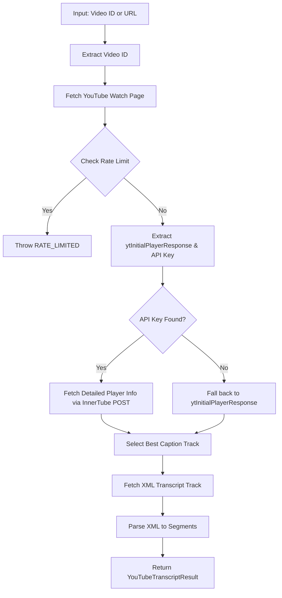

# Architecture & How it Works

`yt-transcript-kit` is designed to be a lightweight, robust, and zero-dependency way to fetch YouTube transcripts. Since YouTube does not provide a simple public API for this, we use a hybrid approach of HTML scraping and Internal API (InnerTube) requests.

## Flow Diagram

## Core Components

### 1. extraction
- **Video ID Logic**: Handles standard URLs, short URLs, embeds, and raw IDs.
- **Embedded JSON**: Finds `ytInitialPlayerResponse` in the watch page's script tags.
- **InnerTube API**: YouTube's internal API. We extract the `INNERTUBE_API_KEY` to make more reliable requests to the `/v1/player` endpoint.

### 2. Selection Logic
- The library prioritizes non-generated (manual) transcripts.
- It supports language fallback. If you request `fr`, it will try to find an exact match, then a loose match (e.g., `fr-CA`), and finally it will throw a `LANGUAGE_NOT_AVAILABLE` if none exist.

### 3. Parsing
- YouTube transcripts are served in two XML formats (depending on the track).
- We use custom regex-based parsing (`XML_TEXT_PATTERN` and `XML_PARAGRAPH_PATTERN`) to avoid heavy XML parser dependencies, keeping the kit lightweight for browser and React Native environments.
- Text is cleaned: HTML tags are stripped, and XML entities are decoded.

## Design Decisions

- **Zero Runtime Dependencies**: Uses native `fetch`. This makes it easy to audit and compatible with almost all modern JS environments (Node 18+, Edge Functions, Browser, React Native).
- **TypeScript First**: All error codes and result shapes are strictly typed.
- **Error Codes**: Uses a custom `YouTubeTranscriptError` class with specific codes (`RATE_LIMITED`, `VIDEO_UNAVAILABLE`, etc.) to allow programmatic handling.

## Known Limitations

- **CORS**: In a standard browser, requests to YouTube will fail due to CORS. This library is intended for server-side use, CLIs, or environments where CORS is relaxed (like browser extensions or React Native).
- **Rate Limiting**: Frequent requests from the same IP will eventually trigger a CAPTCHA.
